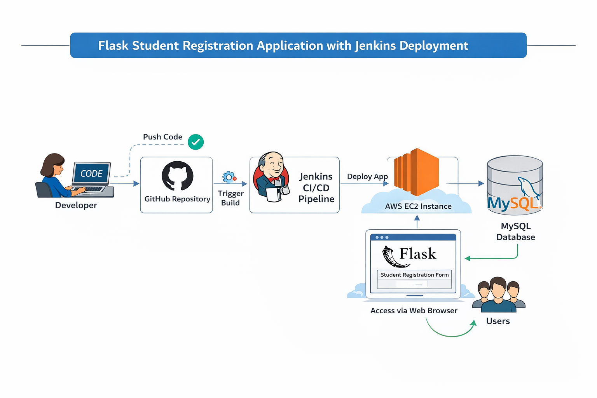
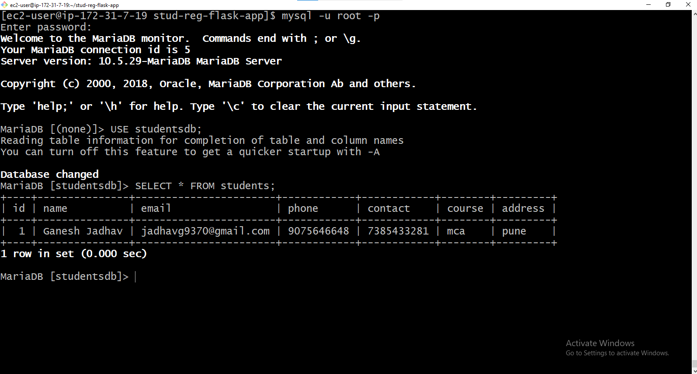

# Flask Student Registration Web Application with Jenkins CI/CD

## Project Name

Student Registration Web Application using Flask and Jenkins Automation

------------------------------------------------------------------------

# Introduction

This project demonstrates the creation and deployment of a **Student
Registration Web Application** built using the Python Flask framework.
The application allows users to submit student details through a web
interface, and the information is stored securely in a **MySQL
database**.

The project also integrates **Jenkins CI/CD** to automate the process of
pulling updated code from GitHub and deploying the application.

------------------------------------------------------------------------

# Key Features

-   Web-based student registration form
-   Backend processing using Flask
-   Data storage using MySQL database
-   Display of registered students
-   Automated deployment using Jenkins
-   Version control using Git and GitHub
-   Deployment on AWS EC2

------------------------------------------------------------------------

# Technologies Used

Frontend - HTML - CSS

Backend - Python - Flask

Database - MySQL

DevOps Tools - Git - GitHub - Jenkins

Cloud Platform - AWS EC2

------------------------------------------------------------------------

# System Architecture

Developer → GitHub → Jenkins Pipeline → EC2 Deployment → Flask
Application → MySQL Database → User Browser



------------------------------------------------------------------------

# Project Structure

    stud-reg-flask-app
    │
    ├── templates
    │   ├── index.html
    │   └── students.html
    │
    ├── static
    │   └── style.css
    │
    ├── app.py
    ├── requirements.txt
    └── README.md

------------------------------------------------------------------------

# Setup Instructions

## Step 1: Launch EC2 Instance

-   Amazon Linux 2023
-   Instance type: t2.micro
-   Open ports: 22, 8080, 5000

------------------------------------------------------------------------

## Step 2: Install Required Software

Update system

``` bash
sudo yum update -y
```

Install Python

``` bash
sudo yum install python3 -y
```

Install pip

``` bash
sudo yum install python3-pip -y
```

Install Git

``` bash
sudo yum install git -y
```

------------------------------------------------------------------------

## Step 3: Install MySQL

``` bash
sudo yum install mariadb105-server -y
```

Start database

``` bash
sudo systemctl start mariadb
sudo systemctl enable mariadb
```

------------------------------------------------------------------------

## Step 4: Database Setup

``` bash
mysql -u root -p
```

``` sql
CREATE DATABASE studentdb;
USE studentdb;

CREATE TABLE students (
id INT AUTO_INCREMENT PRIMARY KEY,
name VARCHAR(100),
email VARCHAR(100),
phone VARCHAR(20),
course VARCHAR(100),
address TEXT
);
```

------------------------------------------------------------------------

## Step 5: Clone Repository

``` bash
git clone https://github.com/swati-zampal/stud-reg-flask-app.git
cd stud-reg-flask-app
```

------------------------------------------------------------------------

## Step 6: Install Dependencies

``` bash
pip3 install flask
pip3 install flask-mysqldb
```

or

``` bash
pip3 install -r requirements.txt
```

------------------------------------------------------------------------

## Step 7: Run Flask Application

``` bash
python3 app.py
```

Open in browser

    http://EC2-PUBLIC-IP:5000

------------------------------------------------------------------------

# Jenkins CI/CD Setup

Install Java

``` bash
sudo yum install java-17-amazon-corretto -y
```

Install Jenkins

``` bash
sudo wget -O /etc/yum.repos.d/jenkins.repo https://pkg.jenkins.io/redhat-stable/jenkins.repo
sudo rpm --import https://pkg.jenkins.io/redhat-stable/jenkins.io-2023.key
sudo yum install jenkins -y
```

Start Jenkins

``` bash
sudo systemctl start jenkins
sudo systemctl enable jenkins
```

Open Jenkins

    http://EC2-PUBLIC-IP:8080

------------------------------------------------------------------------

# Screenshots

  ----------------------------------------------------------------------------------
  Sr No          Screenshot Name                          Image
  -------------- ---------------------------------------- --------------------------
  1              Student Registration Form                

  2              Successful Registration                  

  3              MySQL Database Table                     

  4              Jenkins Build Success                    
  ----------------------------------------------------------------------------------

------------------------------------------------------------------------

# Learning Outcomes

-   Flask web application development
-   HTML form handling
-   MySQL integration with Python
-   Git and GitHub version control
-   Jenkins CI/CD automation
-   AWS EC2 deployment

------------------------------------------------------------------------

# Future Enhancements

-   Add edit/delete student record functionality
-   Improve UI using Bootstrap
-   Add search feature
-   Docker containerization
-   Kubernetes deployment

------------------------------------------------------------------------

# Author

**Rutuja Thombare**\
DevOps Enthusiast \| Cloud Learner

GitHub: https://github.com/RutujaThombare

------------------------------------------------------------------------

# License

This project is created for educational purposes.
